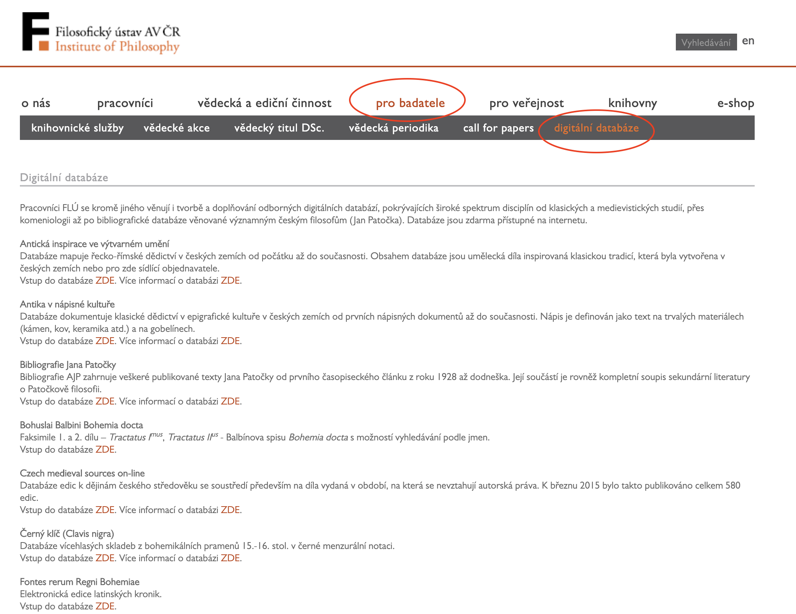
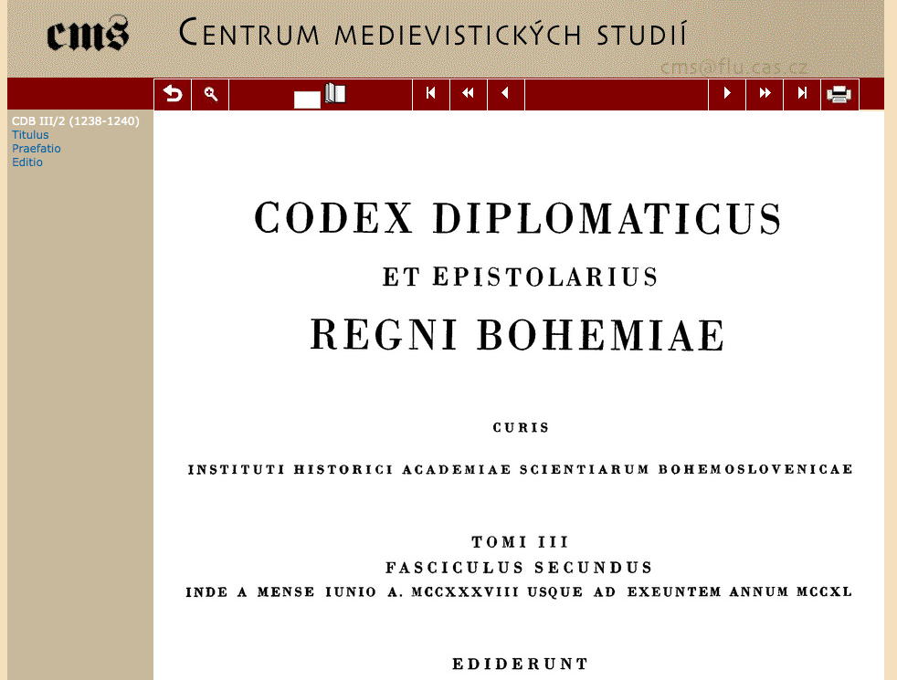
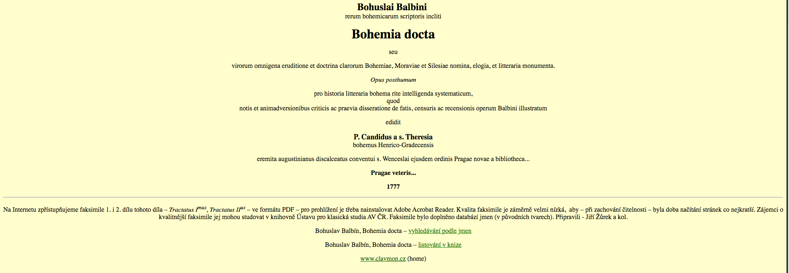
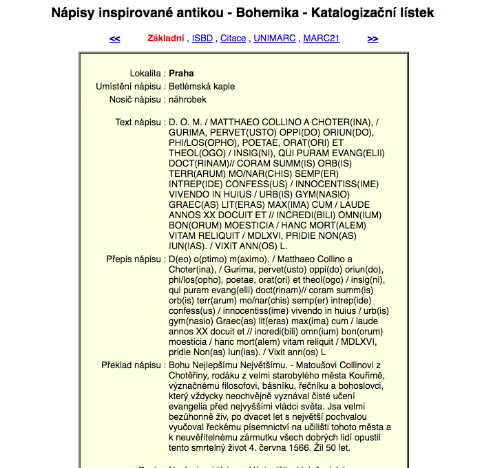
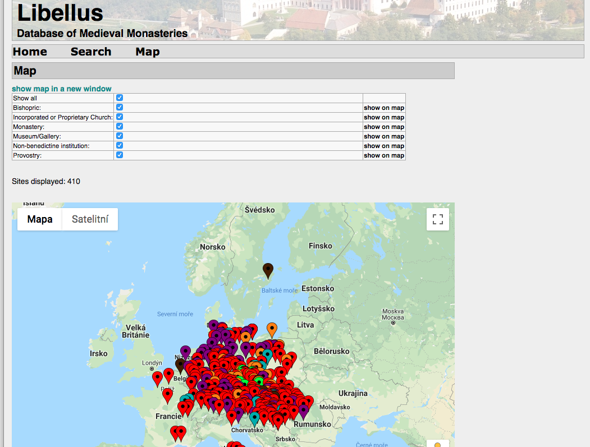
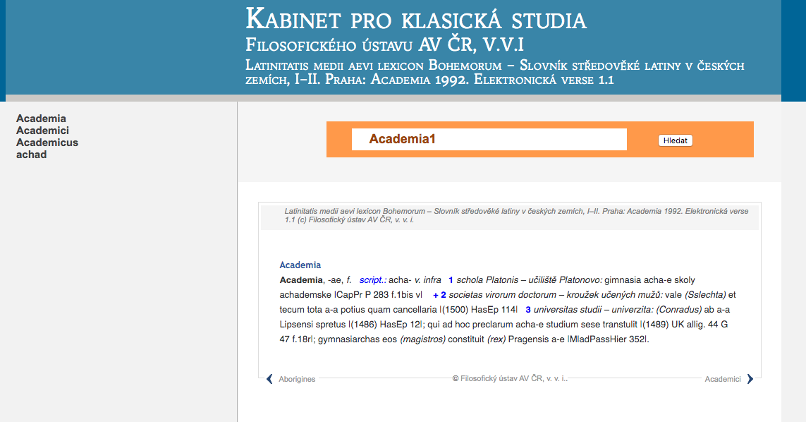
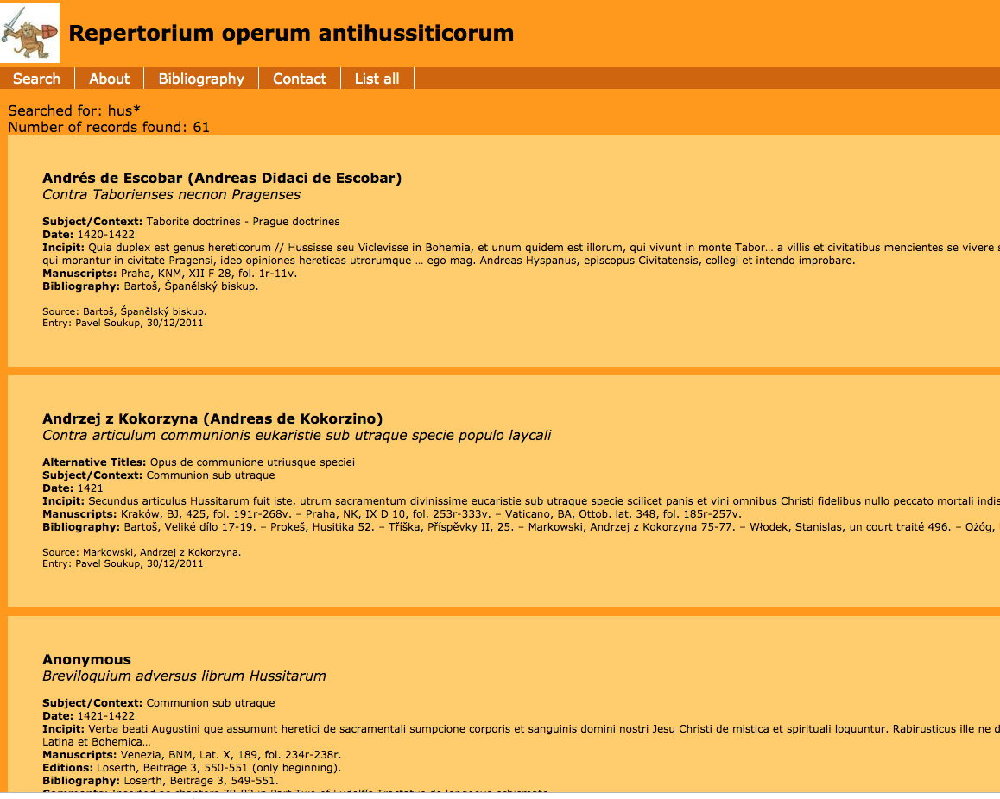
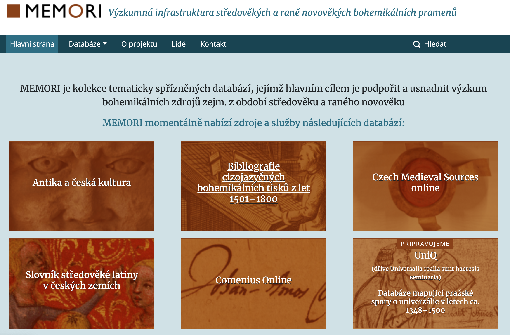

layout: true
<!-- Define general layout features -->

<!-- Logos -->

<!-- Footer -->

Radim Hladík
&emsp;&emsp;&emsp;
@hlageek
&emsp;&emsp;&emsp;&emsp;&emsp;&emsp;&emsp;&emsp;&emsp;&emsp;&emsp;&emsp;
&emsp;&emsp;&emsp;&emsp;&emsp;&emsp;
Institute of Philosophy of the CAS, October 18, 2019
&emsp;&emsp;&emsp;&emsp;&emsp;&emsp;&emsp;&emsp;&emsp;&emsp;&emsp;&emsp;

---

class: remark-title-header

<!-- Title slide -->

# .center[Digital resources and research  at the _Institute of Philosophy of the CAS_]

<!-- Left column -->
.pull-left.center[
.font150[Report for  the _International Advisory Board_] 
Prague (CZ), October 18, 2019

<!-- Logo-->
 

]

<!-- Right column -->

.pull-right.left[ ### Radim Hladík

##### Affiliation
`r icon::fa("university", color = "#9D3B02")` Institute of Philosophy of the Czech Academy of Sciences
  + Centre for Science, Technology, and Society Studies
  + LINDAT/CLARIAH-CZ Working Group 
        
##### Contact
`r icon::fa("envelope", color = "#9D3B02")` <a href="mailto:radim.hladik@fulbrightmail.org ">hladik@flu.cas.cz</a>  
`r icon::fa("twitter", color = "#9D3B02")` <a href="http://twitter.com/hlageek">@hlageek</a>

]

---

# Outline of the presentation

.font200[
1. State of affairs
1. Existing resources
1. Projects
1. International networking
1. Digital research
1. Outlook

]

---

class: center, middle, inverse

# State of affairs

---

# State of affairs: gloom

`r sm <- icon::fa("smile", color = "#9D3B02")`
`r fr <- icon::fa("frown", color = "#9D3B02")`

.font140[
+ __digital resources support traditional research__
  + `r sm` respond to the needs of researchers
  + `r fr` possibilities of computational research untapped
+ __digital resources are dedicated to highly specialized topics__
  + `r sm` relevant to research questions
  + `r fr` limited reach
+ __digital resources are maintained by enthusiasts__
  + `r sm` sustainability despite underfunding
  + `r sm` challenging programming tasks can be outsourced
  + `r fr` optimizations or responses to users' requests are challenging
+ __little awareness about standards and best practices__
  + `r fr` difficulties with linking and converting data
  + `r fr` absent or unclear licensing 

]

---

# State of affairs: bloom

.font140[
Consider the activities of the Department of _Comenius Studies and Early Modern Intellectual History_, which...

+ __digital resources support traditional research__
  + `r sm` ...publishes research that would not be feasible without computational methods
+ __digital resources are dedicated to highly specialized topics__
  + `r sm` ...has enlarged the pool of users by sharing national data internationally 
+ __digital resources are maintained by enthusiasts__
  + `r sm` ...draws support from foreign experts and develops its own expertise
+ __little awareness about standards and best practices__
  + `r fr` ...conforms with the state-of-the-art
  
For a similar example, _cf_. _Dictionary of Medieval Latin in the Czech Lands_

]

---

# State of affairs: note on the libraries and publishing

.font140[

.pull-left[

+ __Library of the Institute of Philosophy__
+ __Library of the Centre for Classical Studies__
+ __Library of the Centre for Medievla Studies__
+ __Filosofia Publishing House__

]

.pull-right[

+ Institute of Philosophy runs 3 libraries, but there is no position of the digital librarian
+ libraries are not involved in digital humanities initiatives
+ our publishing house Filosofia has made efforts to digitize some books and, when possible, make them freely available online
]

]

---

class: center, middle, inverse

# Existing resources

---

# Existing resources

.font150[**http://www.flu.cas.cz/cz/pro-badatele/digitalni-databaze**]

.pull-left[

]

.pull-right[
.font130[
+ 16 listed plus 3-4 unlisted databases of varying scope and content
+ mostly historical focus
+ electronic catalogues, bibliographies, and dictionaries
+ image data supplementary, not primary
+ text data on religious songs
+ scans of texts (without OCR or processing)
+ GIS-based database on medieval monasteries (_Libellus_)

]]

---

# Existing resources - examples

## Czech Medieval Sources Online

.center[

]

---

# Existing resources - examples

## Bohuslai Balbini Bohemia docta

+ scans plus name tags

.center[

]

---

# Existing resources - examples

## Ancient times in epigraphic culture

.center[

]

---

# Existing resources - examples

## Libellus

.center[

]

---

# Existing resources - examples

## Dictionary of Medieval Latin in the Czech Lands

.center[

]

---

# Existing resources - examples

## Repertorium operum antihussiticorum

.center[

]

---
class: center, middle, inverse

# Projects

---

# Projects - sources of funding

.font130[

+ __NAKI__ (Applied Research and Development of National and Cultural Identity by the Ministry of Culture)
  + INDIHU - development of tools and infrastructure for digital humanities
    + 6 humanities institutes of the CAS, Library of the CAS, National Library
+ __Strategy AV21__
  + inter-institutional research programmes of the CAS
  + _Memory in the Digital Age_ - supports e.g. the database of medieval monasteries
+ __ÉTA__ (grant programme of the Technology Agency of the Czech Republic for the social sciences and the humanites)
    + supports a project on AI and ethics
    + an application by our medieval scholars rejected on the grounds of mismatch with the programme's scope and goals
+ __Large Research Infrastructures__ (Ministry of Education)
  + LINDAT/CLARIAH-CZ - infrastructure for language resources and digital humanities
]

---

# Projects - MEMORI (CLARIAH-CZ)

.font150[

.pull-left[

**http://memori.flu.cas.cz**
]

.pull-right[
+ Research infrastructure for the medieval and early-modern Bohemical sources
+ 5 existing databases plus 1 new
+ flagship for the development of our electronic resources
+ collaboration with the Library of the CAS
+ comes with an investment sub-project that should help to modernize the IT infrastructure

]]

---

# Projects - Patočka Digital (CLARIAH-CZ)

.font150[

.pull-left[
  

**http://patockadigital.janpatocka.cz/**
]

.pull-right[

+ corpus of Jan Patočka's work
+ primary and secondary bibliography
+ the only significant dataset based on text (potential for text mining)
+ other interesting data sources: audio files (testing ground for indexing and transcription by NLP technologies), photos, videos
+ focus on philosophy
+ favorable copyright situation

]]

---

class: center, middle, inverse

# International networking

---

# International networking

.font140[
+ AITIA consortium: Archives of International Theory: an Intercultural Approach to Theoretical Manuscripts
    + Comenius, Patočka
    + CNRS-funded workshops, events, networking
+ COST Action
    + NEP4DISSENT – New Exploratory Phase in Research on East European Cultures of Dissent
    + Re-assembling the Republic of Letters
+ Union Académique Internationale
    + Corpus of Ancient Vases
    + Dictionary of Medieval Latin in the Czech Lands
    + Repertory of the Literature in the Czech Lands until 1800
+ European Network of Research and Documentation of Ancient Greek Drama
]

---
class: center, middle, inverse

# Digital research

---

# Digital research: computational analyses

.font140[

Computational research remains rare, but some examples can be provided:

+ Rhetorical strategies in Comenius's correspondence - did Comenius adapt writing style based on the addressees? (Storchová, L. & Urbánek, V.)
+ Frequency analysis and visualization of biblical quotations in Comenius's work (Havelka, T.)
+ Visualization methods for highly mobile correspondents (Urbánek, V.)
+ Personal networks and early-modern systems of patronage (Lelková, I.)
+ Knowledge representation using Transparent Intensional Logic as foundation for TIL-Script language in multi-agent models (Materna, P.)
+ Literary and scientific styles in Czech sociological writing (Hladík, R.)
+ Topic analysis of Czech sociological articles (Hladík, R.)
]

---

# Digital research: applications beyond the database

.font140[
+ Video
  + Digitalization and visualization of J. A. Comenius’ correspondence (1592–1670)   https://vimeo.com/147446184
+ Virtual exhibition
  + Philosopher's Being - and Time  https://my.matterport.com/show/?m=JguEFtshpUo
+ Web application
  + Evalvis 17+ Visualization of the bibliometric evaluation of the Czech R&D results   http://evalvis.flu.cas.cz/
]
---

class: center, middle, inverse

# Outlook

---

# Outlook

.font150[
+ postdoctoral position dedicated to the computational research in the humanities
+ project-based funding threatens sustainability 
+ adoption of Plan-S policies on national scale will affect the research outputs and will increase the role of digital repositories 
  + as a part of HR project (currently in the evaluation pipeline), questions of open access could gain an impetus in the near future

]

---

# Open questions

.font150[
+ How can we embed our resources and research in international networks?
    + Are there relevant EU-wide projects ongoing or about to be launched?
+ What good practices exist to enlarge and deepen digital research in the tradionally oriented humanities institutions?
  + Can we go beyond infrastructures?
+ How to bring focus to scattered researchers and topics?
+ How to reward labour-intensive digital initiatives in a research funding system that does not recognize digital outputs?
+ What are the experiences with funding for e-infrastructures at your institutions?
]